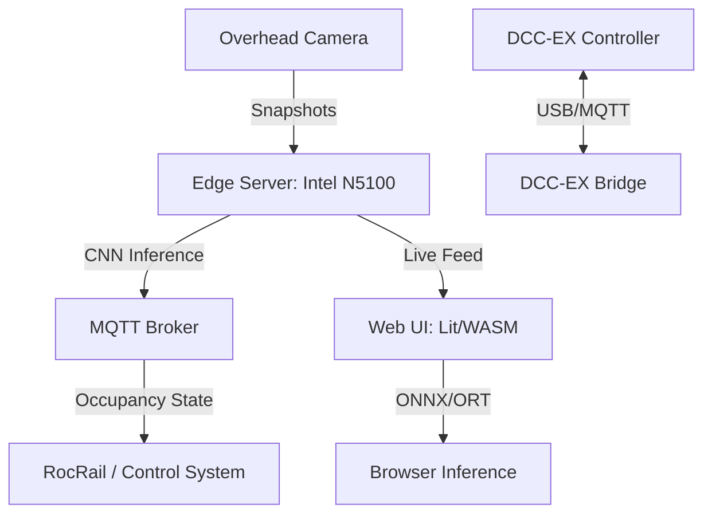

# 🚂 Track Occupancy Detection

[]()
[]()
[]()

An integrated, end-to-end computer vision suite for model railroaders to detect track occupancy using deep neural networks.

---

## 🌟 Overview

This project provides a professional, camera-based solution for track occupancy detection. Moving beyond traditional infrared or current-sensing solutions, this system utilizes overhead cameras and CNN-based image classification to identify trains and rolling stock with high precision, regardless of lighting conditions or complex track geometries.

### Key Benefits
- **High Reliability**: Robust detection even in challenging environments.
- **Unified Logic**: Shared classification code between the edge server and the web browser.
- **Low Latency**: Inference takes ~100ms per sample on fanless hardware.
- **Modern UI**: A responsive, Lit-based single-page application for monitoring and configuration.

---

## 🛠 Technology Stack

| Layer | Technologies |
| :--- | :--- |
| **Deep Learning** | [Fastai](https://docs.fast.ai/), [PyTorch](https://pytorch.org/), [ONNX Runtime](https://onnxruntime.ai/) |
| **Frontend** | [Lit](https://lit.dev/), [TypeScript](https://www.typescriptlang.org/), [Vite](https://vitejs.dev/) |
| **Backend** | [Node.js](https://nodejs.org/), [Docker](https://www.docker.com/), [MQTT](https://mqtt.org/) |
| **Tooling** | [uv](https://github.com/astral-sh/uv), [pnpm](https://pnpm.io/), [Rsync](https://rsync.samba.org/) |

---

## 🏗 System Architecture



---

## 📂 Project Structure

- **`cnn/`**: Python environment for model training and validation.
  - `TRAIN.ipynb`: Training pipeline and ONNX/ort export.
  - `TEST-CNN.ipynb`: Performance benchmarking and validation.
- **`ui/`**: Static single-page web application built with Lit.
- **`control/`**: Server-side logic and Docker orchestration.
  - `track-occupancy`: Main detection service. Reads the camera and does the cnn interference. Very CPU intensive.
  - `dcc-ex-bridge`: MQTT/USB bridge for DCC control.
- **`lib/`**: Shared TypeScript libraries.
  - `@occupancy/classifier`: Unified inference wrapper (Server/Browser).
  - `@occupancy/r49`: Schema and parser for railroad configuration.
  - `@occupancy/uid`: Snowflake-based unique ID generation.
    - `nodeid 1`: Labels (track, coupling, train)
    - `nodeid 2`: Image files
    - `nodeid 3`: Camera configuration files
- **`dataset/`**: Training data, labels, and `.r49` layout definitions.

---

## 🚀 Development Workflow

### 1. Model Training
Managed via `uv` in the `cnn/` directory.
```bash
cd cnn
uv run jupyter notebook
```
- Open `TRAIN.ipynb` and choose `Run All` to train the classifier.
- Models are exported to `cnn/models/` in ONNX format for cross-platform compatibility.

### 2. Frontend Development
Managed via `pnpm` in the workspace root.
```bash
pnpm install
cd ui
pnpm dev
```

### 3. Deployment
The system is designed for deployment to a fanless Intel N5100 server running Ubuntu.
```bash
./deploy.sh
```
This script synchronizes code, builds UI assets, and restarts the Docker stack.

---

## 📡 API Reference

The edge server provides the following endpoints (accessible via `ui.rails49.org`):

| Endpoint | Method | Description |
| :--- | :--- | :--- |
| [/api/snapshot](https://ui.rails49.org/api/snapshot) | `GET` | Retrieve the latest camera snapshot. |
| [/api/r49](https://ui.rails49.org/api/r49) | `GET/POST` | Fetch or update layout configuration (.r49). |
| [/api/test-cnn](https://ui.rails49.org/api/test-cnn) | `GET` | Run a diagnostic test of the classifier. Used by `TEST-CNN.ipynb`. |
| [/api/sensors](https://ui.rails49.org/api/sensors) | `GET` | Retrieve server health and sensor statistics. `node` runs the classifier, `ffmpeg` aquires images from the camera, both in the track-occuppancy detector. |

---

## 🖥 Server Management

- **Hardware**: Intel N5100 (Kamrui Fanless PC) running Ubuntu.
- **Access**: `ssh blocks` to login to the primary server.
- **Dashboard**: Traefik dashboard available at [traefik.rails49.org](https://traefik.rails49.org).
- **Control**: All services are managed via Docker Compose within the `control/` stack.

---

## 📄 License

This project is licensed under the [MIT License](https://opensource.org/license/mit).
