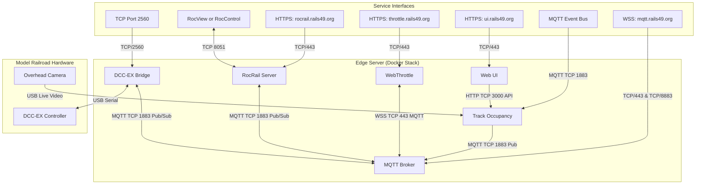

# 🚂 Modelrailroad Track Occupancy Detection

[]()
[]()
[]()

A computer vision suite for model railroaders to detect track occupancy using deep neural networks.

---

## 🌟 Overview

This project provides a camera-based solution for track occupancy detection based on overhead cameras and CNN-based image classification to identify trains and rolling stock with high precision.

### Key Features
- **High Reliability**: Accurate train detection even in challenging environments.
- **Server Based Architecture**: Individual features are deployed as microservices in Docker containers on an edge server.
- **Single Page Web UI**: A responsive, Lit-based single-page application for monitoring and configuration.
- **Domain and DNS managed by Cloudflare**: Fully secure local HTTPS subdomains (e.g. `rails49.org`) without external port forwarding.

---

## 🛠 Technology Stack

| Layer | Technologies |
| :--- | :--- |
| **Deep Learning** | [Fastai](https://docs.fast.ai/), [PyTorch](https://pytorch.org/), [ONNX Runtime](https://onnxruntime.ai/) |
| **Frontend** | [Lit](https://lit.dev/), [TypeScript](https://www.typescriptlang.org/), [Vite](https://vitejs.dev/) |
| **Backend** | [Node.js](https://nodejs.org/), [Docker](https://www.docker.com/), [MQTT](https://mqtt.org/) |
| **Tooling** | [uv](https://github.com/astral-sh/uv), [pnpm](https://pnpm.io/), [Rsync](https://rsync.samba.org/) |

---

## 🏗 System Architecture

The entire system is managed via Docker Compose on an edge server. The architecture consists of 

* Edge server (a computer capable of running a docker stack)
* A usb camera connected to the track-occupany detector
* [DCC-EX Command Station](https://dcc-ex.com/index.html#gsc.tab=0) connected to the ddc-ex-bridge service on server via USB.
* All external ingress (except port 8051 to the rocrail-server) pass through a traefik proxy. See the [Docker Control Stack Documentation](control/README.md) for detailed configurations of DNS, proxy, SSL, and network administration.

### Service Architecture & Mappings



---

## 📂 Project Structure & Features

The project is structured into modular components, each with its own comprehensive documentation:

### Getting Started & Installation

*   **[New Edge Server Installation Guide (doc/INSTALL.md)](doc/INSTALL.md)**: Full step-by-step instructions to configure Cloudflare Wildcard DNS, set up environment variables, and deploy the stack onto a fresh edge server.
*   **[Project Tooling and Environment (doc/TOOLING.md)](doc/TOOLING.md)**: Details our Python-TypeScript hybrid development environment, workspace configurations, and key architectural choices (like single-language parsing and environment isolation).

### Core Services & Applications

*   **[Web UI (ui/)](ui/README.md)**: A responsive Lit-based single-page application for model railway monitoring and camera alignment.
*   **[WebThrottle (webthrottle/)](webthrottle/README.md)**: A browser-based virtual DCC throttle optimized for mobile/tablet screens.
*   **[Docker Control Stack (control/)](control/README.md)**: Handles edge server administration, DNS setup, security, Traefik reverse proxy, and NanoMQ MQTT broker.
    *   **[Track Occupancy Detector (control/track-occupancy/)](control/track-occupancy/README.md)**: TS backend that acquires camera feeds, performs ONNX classifier inference, and publishes occupancy states via MQTT. Includes the REST API specification.
    *   **[DCC-EX Bridge (control/dcc-ex-bridge/)](control/dcc-ex-bridge/README.md)**: MQTT/USB gateway that multiplexes commands safely to the DCC-EX Command Station.
    *   **[Rocrail Server (control/rocview-server/)](control/rocview-server/README.md)**: Persistently mounted Rocrail control workspace with automatic nightly Git backups and integration specs.

### Machine Learning Pipeline

*   **[CNN Classifier (cnn/)](cnn/README.md)**: Python environment for training, validating, and exporting the ResNet-18 model to ONNX/ORT format.
*   **[Dataset Preparation (dataset/)](dataset/README.md)**: Tools to extract training image crops from `.r49` railroad layout archives and split datasets deterministically.

### Shared TypeScript Libraries

*   **`lib/`**: Unified helper and schemas packages.
    *   **[`@occupancy/r49` (lib/r49/)](lib/r49/README.md)**: Zod schemas and archive management for `.r49` layout archives.
    *   **[`@occupancy/uid` (lib/uid/)](lib/uid/README.md)**: Snowflake-based alphanumeric unique identifier generator.

---

## 🚀 High-Level Development Workflow

1.  **Model Training**: Prepare the dataset in `dataset/` and train the CNN classifier in `cnn/` to output an optimized `.ort` model. Refer to the [CNN Training Guide](cnn/README.md) and [Dataset Prep Guide](dataset/README.md) for details.
2.  **Frontend Development**: Test and build the Lit components in `ui/` or `webthrottle/`. Refer to the [UI Dev Guide](ui/README.md) and [WebThrottle Dev Guide](webthrottle/README.md).
3.  **Deployment**: Deploy the Docker stack to the server using the workspace deployment script:
    ```bash
    ./deploy.sh
    ```
    *Refer to the [Control Deployment Steps](control/README.md#quickstart) and the [New Edge Server Installation Guide](doc/INSTALL.md) for environment and custom domain configurations. For developer workspace tooling setup, refer to the [Project Tooling Guide](doc/TOOLING.md).*

---

## 📄 License

This project is licensed under the [MIT License](https://opensource.org/license/mit).
