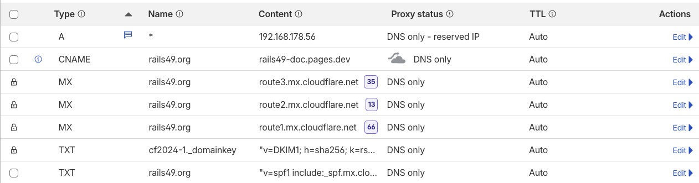
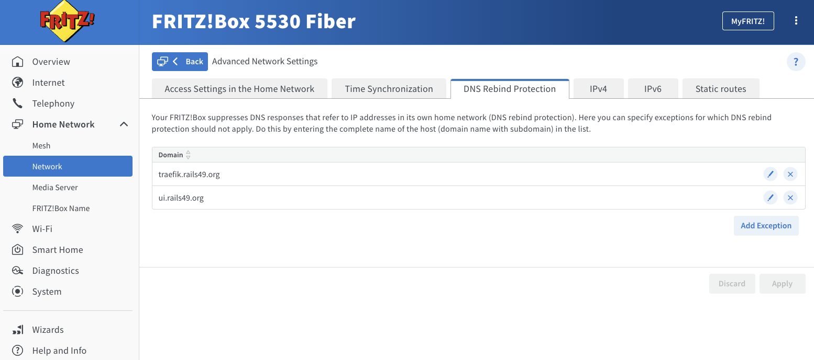

# Rails49: Train Control

Docker stack supporting autonomous operation of model railroads.

## Architecture

Rails49 uses a microservices architecture managed by Docker Compose. Traefik acts as the central gateway, providing TLS termination and subdomain-based routing.

**Security Note:** This stack is designed for **Local Network Use Only**. It does not include authentication. Traefik is configured with an IP Whitelist to reject any connections originating from outside your private local network.

### Hardware & OS (Server)

* **Edge Server**: presently a KAMRUI JK06 Fanless Mini PC
  * Intel 11th Gen N5100, 8GB DDR4, 256GB ROM, Dual WiFi / LAN / USB 3.0 / Type C
* **Operating System**: Ubuntu
* **Access**: `ssh rails49`
  ```ssh-config
  Host rails49
      HostName blocks49.local
      User ttmetro
  ```

### DNS Setup

Add a **wildcard A record** in Cloudflare: `*.rails49.org → <server-LAN-IP>` (e.g., `192.168.1.50`).



By pointing the domain to a **Private LAN IP**, the subdomains will resolve only for devices inside your home network. External users will see a private IP they cannot reach. 

This setup allows you to use real SSL certificates (for camera/microphone features in the browser) without ever exposing your services to the internet.

Also disable DNS Rebind Protection on the Router (e.g. FritzBox):



---

## Services

### 🎛️ [Traefik Gateway](traefik/README.md)
Dynamic reverse proxy, TLS termination, and subdomain router managing secure local connection entrypoints (HTTPS, WSS, MQTTS, TCP).
*   **Detailed Documentation**: [Traefik Gateway Guide](traefik/README.md)
*   **Key Configs**: [`traefik/traefik.yaml`](traefik/traefik.yaml) (static), [`traefik/dynamic_conf.yaml`](traefik/dynamic_conf.yaml) (dynamic/security whitelist).

---

### 📡 [MQTT Broker (NanoMQ)](mqtt/README.md)
The central messaging backbone routing real-time status and control commands between all services over native TCP and secure WebSockets.
*   **Detailed Documentation**: [MQTT Broker Guide](mqtt/README.md)
*   **Key Config**: [`mqtt/nanomq.conf`](mqtt/nanomq.conf).

---

### 🌐 [nginx Web UI & WebThrottle Servers](nginx/README.md)
Serves the pre-compiled static Single Page Applications (SPAs) for the main monitoring/configuration UI and browser-based WebThrottle.
*   **Detailed Documentation**: [Nginx Servers Guide](nginx/README.md)
*   **Key Config**: [`nginx/default.conf`](nginx/default.conf).

---

### 🎥 [Track Occupancy Detector](track-occupancy/README.md)
High-performance TypeScript backend that handles camera video acquisition, parallelized ONNX Deep Learning classifier runs on layouts, and MQTT occupancy state updates.
*   **Detailed Documentation & REST API Reference**: [Track Occupancy Detector Guide](track-occupancy/README.md)
*   **Key Source**: [`track-occupancy/src/`](track-occupancy/src/).

---

### 🔌 [DCC-EX Bridge](dcc-ex-bridge/README.md)
A Command-Aware Multiplexer that connects the physical DCC-EX Controller over USB serial, hosting a raw TCP socket and translation bridge to MQTT command topics.
*   **Detailed Documentation & MQTT Topic Reference**: [DCC-EX Bridge Guide](dcc-ex-bridge/README.md)
*   **Key Source**: [`dcc-ex-bridge/`](dcc-ex-bridge/).

---

### 🚂 [Rocrail Server](rocview-server/README.md)
Persistently mounted Rocrail control workspace with integrated cron jobs for nightly configuration and layout XML git backups.
*   **Detailed Documentation & Troubleshooting**: [Rocrail Server Guide](rocview-server/README.md)
*   **Key Workspace**: [`rocview-server/workspace/`](rocview-server/workspace/).


---

## Quickstart

```bash
# 1. Configure the master environment file in the repository root
cp ../.env.example ../.env

# 2. Copy the configured master environment to control/
cp ../.env .env

# 3. Build the frontends from the repository root
cd ../.. && pnpm run build && cd control

# 4. Start the stack
docker compose up -d

# 5. Follow logs
docker compose logs -f
```

---

## DCC-EX Protocol Reference

A simplified subset of the [DCC-EX Command Summary](https://dcc-ex.com/reference/software/command-summary-consolidated.html).

### System Status

```text
<s>
```

Example responses:
```text
<iDCC-EX V-5.4.16 / ESP32 / EXCSB1_WITH_EX8874 G-devel-202504182148Z>
<p1 A>
<p1>
<p1 JOIN>
<@ 0 2 "Power On JOIN">
```

### Accessories / Turnouts

```text
<a addr activate>
```

* `addr`: DCC address (1–2044)
* `activate`: `1` = thrown, `0` = closed

**DP1 Turnout Motor** (set address to `10`, factory default `5`):
1. Hold button 5 s until LED blinks rapidly.
2. Send `<a 10 0>`. LED stops blinking.

### Locomotives

**Speed & Direction**:
```text
<t cab speed dir>
```
* `cab`: DCC address
* `speed`: 0–127 (or `-1` for Emergency Stop)
* `dir`: `1` = forward, `0` = reverse

**Functions**:
```text
<F cab funct state>
```
* `funct`: 0–68 (`0` = headlight)
* `state`: `1` = on, `0` = off