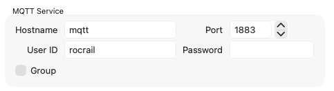

# Rocrail Server in Docker

This directory contains the files to run a Rocrail server in a Docker container.

## Setup Instructions

### Build and Start

**Important!** Setup a router rebind protection exception if your router needs it (e.g. FritzBox).

The Rocrail service is integrated into the main `docker-compose.yml`. The Dockerfile is configured to automatically download the latest Rocrail snapshot during the build process.

```bash
./deploy.sh
```

### Connect with Rocview
From your desktop computer (macOS/Windows/Linux), run the **Rocview** client and connect to the server:

- **Host**: `rocrail.rails49.org` (or the IP of your Mini PC)
- **Port**: `8051`

The Rocrail server monitor is available at [https://rocrail.rails49.org/](https://rocrail.rails49.org/) (no `:8088!).

### Configure DCC-EX Controller
In Rocview:
1. Go to **File > Rocrail Properties**.
2. Select the **Controller** tab.
3. Add a new controller of type `dccpp`.
4. In the properties of the `dccpp` controller:
   - **Hostname**: `dcc-ex-bridge` (This refers to the container name in the Docker network)
   - **Port**: `2560`
5. Click OK and **restart the Rocrail server** (via Docker).

## 📡 Ingress & Ports

- **Rocview Client (TCP)**: Port `8051`
  - Exposed directly via port mapping on the host (connect using host IP or `rocrail.rails49.org`).
- **Server Monitor Ingress**: `https://rocrail.rails49.org`
  - Traefik terminates SSL and routes HTTP traffic internally to the Rocrail web port `8008`.

## MQTT

File > Rocrail Properties > Services:



Control sensor state:
```bash
mosquitto_pub -h mqtt.rails49.org -p 8883 -t rocrail/service/client -m '<fb id="fb1" state="false"/>'
mosquitto_pub -h mqtt.rails49.org -p 8883 -t rocrail/service/client -m '<fb id="fb1" state="true"/>'
```

---

## 📂 Layout Workspace & Git Backups
The layout workspace (where `plan.xml` and `rocrail.ini` are stored) is mounted persistently from the host at:
`./control/rocview-server/workspace`

Any changes you make in Rocview and save are persisted directly in this directory.

### ⏱️ Automatic Nightly Backups
To protect your layout configuration, a nightly cron job runs at **3:00 AM** to stage all changes, commit them locally, and push them to the [rocrail-workspace GitHub Repository](https://github.com/iot49/rocrail-workspace).

To configure or restore the cron job on the server:
```bash
(crontab -l 2>/dev/null; echo "0 3 * * * /home/ttmetro/track-occupancy/backup-rocrail-workspace.sh >> /home/ttmetro/track-occupancy/backup.log 2>&1") | crontab -
```

### 🛠️ Manually Triggering a Push
If you have made significant changes in Rocview and want to backup/push them immediately to GitHub without waiting for the nightly job, run:
```bash
ssh rails49 "/home/ttmetro/track-occupancy/backup-rocrail-workspace.sh"
```

---

## 🛠️ Troubleshooting & Workarounds

### Rocrail MQTT Connection Workaround
If Rocrail fails to connect to the MQTT broker, it is likely due to the MQTT Client ID configuration. Editing the `workspace/rocrail.ini` file on the server and ensuring `mqttclientid="rocrail"` is set solves this protocol issue.

Example configuration line in `rocrail.ini`:
```xml
  <tcp port="8051" controlcode="" slavecode="" slavecode_power="true" slavecode_switches="true" slavecode_signals="true" slavecode_outputs="true" slavecode_routes="false" slavecode_locos="true" onlyfirstmaster="false" clienthostname="true" wiowd="true" wioonlineinfo="true" wiotimeout="700" wiowd_exclude="" wiowdbreak="0" with="true" withport="12090" withhttpport="8008" withHB="10" mdns="true" mdnsID="Rocrail" clientid="rocrail" mqtthost="172.20.0.7" mqttclientid="rocrail" mqttport="1883" mqttuserid="rocrail" mqttpasswd="" mqttgrouping="false"/>
```
